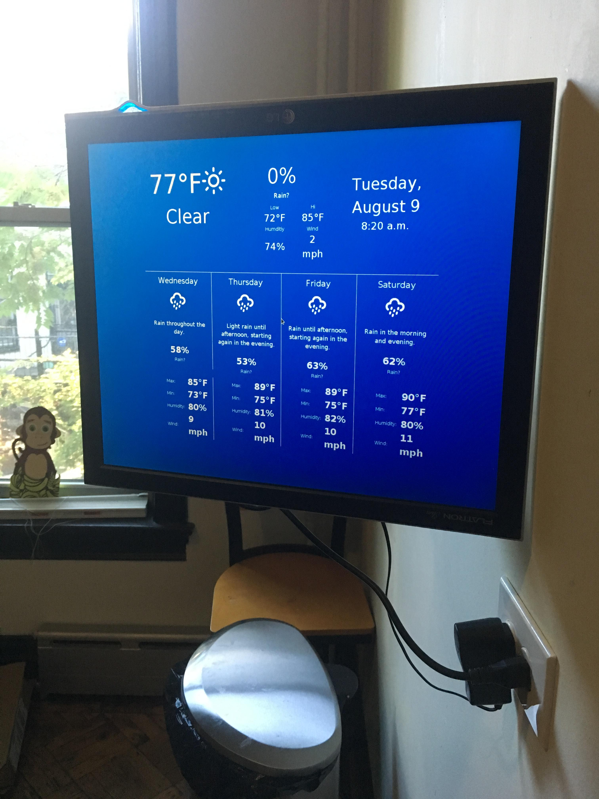
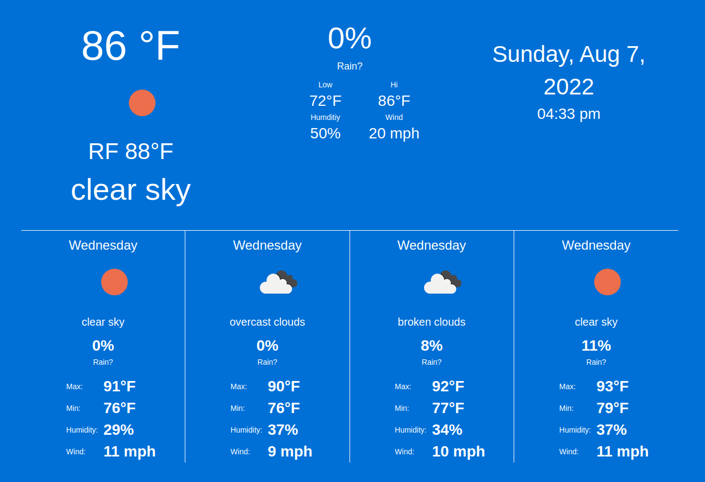

# Weather Pi
Customized weather station for a Raspberry Pi.

I repurposed a spare LCD screen into a custom weather monitor with the help of a Raspberry Pi, and I thought I'd share the details to help others.





Many people have done variants of this before, e.g.:

http://www.raspberryweather.com/

https://www.raspberrypi.org/blog/school-weather-station-project/

Main differences are:

1. I wanted professional weather report, not to take my own measurements
1. I wanted to format the information in a custom way -- just the stats, no Doppler radars, advertising, etc.

When I created this years ago I used the Dark Sky API, which was then free. 

But it was acquired by Apple, which replaced it with [Weather Kit](https://developer.apple.com/weatherkit/), which requires a [$99/year subscription to the Apple Developer program](https://developer.apple.com/support/compare-memberships/), so now this uses the [Open Weather API](https://openweathermap.org/api), which has a free tier limited to 1K API calls per day.

## Quick notes

- Open Weather API is free but requires a credit card in case you go over the 1K/day limit
- This app is designed to stay under the limit, so the NodeJS backend will only query Open Weather once every 15 minutes
- My sample front end will hit the back end every 5 minutes for an update, but it won't retrieve new weather data until the time limit has passed
- Raspberry Pis used to be cheap ($40) but they became popular during Covid and now are 3x that (~ $120)

# Software setup

Before getting into hardware ensure you have the software working.

## Open Weather API

[Sign up for the Open Weather API](https://openweathermap.org/api). You'll need to enter a credit card in case you go over the [free tier service limit of 1K calls/day](https://openweathermap.org/faq#onecall) so that may turn some people off, but this app is designed to keep you under the limit.

Once you've registered they will email you an API key, like `j28oba227tpfyk0mljshtlvng9oteq95w` (that's not real, won't work, just an example).

You also need to go to https://openweathermap.org/api and hit "Subscribe" (this is where they ask you for a CC). Then and only then can you hit their API.

## Latitude and longitude

Besides your Open Weather API key you'll need your latitude and longitude coordinates. You can find these in [Google Maps](https://www.google.com/maps). Write these down.

## Clone this repo

Clone this repo to your local machine.

## Ensure you're running the correct version of Node.

The version of Node this code is meant to run on is stored in the `.nvmrc` file. Enter `nvm use` to use that version or [read up on how](https://www.google.com/search?q=how+to+use+nvmrc+files&oq=how+to+use+nvmrc+files&aqs=chrome..69i57j0i22i30j0i390l3.4022j0j4&sourceid=chrome&ie=UTF-8).

## Install the dependencies

`npm i` will install the depedencies.

## .env file

Copy the `.env.example` to `.env` in the root directory and update the values.

`cp .env.example .env`

then edit

```
OPEN_WEATHER_API_KEY=ENTER_YOUR_KEY_HERE
OPEN_WEATHER_API_LATITUDE=34.0139
OPEN_WEATHER_API_LONGITUDE=-118.2864
OPEN_WEATHER_API_UNITS=imperial
```

Enter your key, update your coordinates, and if you want change units from `imperial` to `metric`.

## Test the software

Next test the API backend:

`npm start`

You should see:

`App listening on port 3000`

Open up a web browser and go to [http://localhost:3000]. You should get weather data. If not, something is wrong, start over and repeat these steps carefully.

## Parts
* 1 19" LG LCD monitor
* 1 USB keyboard
* 1 USB mouse
* 1 [Swingarm wall mount for monitor](https://www.amazon.com/gp/product/B003O1UYHG) - ($22)
* 1 [Raspberry Pi 3 Model B](https://www.amazon.com/s?k=raspberry+pi+3+model+b) - ($40 when I bought it, now insane prices post-Covid)
* 1 [Official RPI 3 Case](https://www.amazon.com/gp/product/B01F1PSFY6) - ($10)
* 1 [CanaKit 5V 2.5A RPI 3 Power supply](https://www.amazon.com/gp/product/B00MARDJZ4) - ($12)
* 1 [SanDisk 64GB microSD card, plus adapter](https://www.amazon.com/gp/product/B010Q588D4) - ($17)
* 1 [Bag of zipties](https://www.amazon.com/Plastic-Cable-Ties-100-Pack-Black/dp/B002C0SKBW) - ($7)
* 1 [Stud finder](https://www.amazon.com/Zircon-StudSensor-e50-Electronic-Finder/dp/B002R5AVVY) - ($20)

## Total cost: $128 (or more for Rasberry Pi these days)

Monitor normally is the biggest expense.

## Step 1: Download and install Raspbian onto microSD card

[Download and install Raspian](https://www.raspberrypi.com/documentation/computers/getting-started.html), a common OS for Pi.

I recommend the "Desktop with recommended software" version but you can use the others and manually add on software you will need later.

Once Raspbian has been flashed to the MicroSD card, boot up the Pi and go through the initial set up (language, WiFi, updates, etc).

When that is complete, go to into Pi > Raspberry Pi Configuration and in the interfaces tab enable SSH (also might be worth enabling VNC, which is slightly more user-friendly).

## Step 2: SSH into the Pi and upgrade node

You'll likely want to upgrade the version of Node that comes deault onto Raspbian.

Either SSH into your Pi or from the Pi terminal enter (replacing the bracket text with what you see in `.nvmrc`):

```
sudo npm i -g n
n [version of node in .nvmrc file]
```

You'll also need to create the `www` under `/var/` and make it readable so:

```
sudo mkdir /var/www
sudo chmod 755 /var/www
```

### Step 3: Copy over the files

I recommend [FileZilla FTP](https://filezilla-project.org/). Get the IP address from the box by `ifconfig` from the terminal or looking at our router settings. In FileZilla select `SFTP`, enter the IP, user: `pi`, password whatever you changed it to during setup.

Copy over the files to `/var/www/weather-station` or whatever directory you want under `/var/www`.

### Step 4: Create a service

To run the background service that fetches the data from Open Weather create a service file:

```
sudo touch /etc/systemd/system/weather-station.service
```

Then edit it:
```
sudo nano /etc/systemd/system/weather-station.service
```

Enter enter:
```
[Unit]
Description=Weather Station

[Service]
ExecStart=/usr/local/bin/node /var/www/weather-station/src/startup.js
Restart=always
User=nobody

Group=nogroup
Environment=PATH=/usr/bin:/usr/local/bin
Environment=NODE_ENV=production
WorkingDirectory=/var/www/weather-station

[Install]
WantedBy=multi-user.target
```
Note if you didn't uprade node to v12 the binary will be in a different location than `/usr/bin/local/node`

Then start up the service:
```
sudo systemctl start weather-station
```

Enable it to run on boot with:
```
sudo systemctl enable weather-station
```

Test it with: `curl http://localhost:3000`. You should see results. If not, check the logs `journalctl -u weather-station`

### Step 5: Install Chromium and set the Pi to boot into Chromium Kiosk mode

To display the front end HTML, you'll need Chromium.

```
sudo apt-get install chromium
```

Then you'll want to auto-boot into Chromium with Kiosk mode opening the front end of the application:

For me what worked was [http://raspberrypi.stackexchange.com/questions/38515/auto-start-chromium-on-raspbian-jessie-11-2015](http://raspberrypi.stackexchange.com/questions/38515/auto-start-chromium-on-raspbian-jessie-11-2015):

Create a new `.desktop` file in `~/.config/autostart/`, e.g.

```
sudo nano ~/.config/autostart/autoChromium.desktop
```


```
[Desktop Entry]
Type=Application
Exec=/usr/bin/chromium-browser --noerrdialogs --disable-session-crashed-bubble --disable-infobars --kiosk --disable-component-update file:///var/www/weather-station/html/index.html
Hidden=false
X-GNOME-Autostart-enabled=true
Name[en_US]=AutoChromium
Name=AutoChromium
Comment=Start Chromium when GNOME starts
```

### Step 6: Disable monitor dimming

Raspian will turn off the monitor after a certain period of inactivity. To disable this feature:

Via [http://raspberrypi.stackexchange.com/questions/2059/disable-screen-blanking-in-x-windows-on-raspbian](http://raspberrypi.stackexchange.com/questions/2059/disable-screen-blanking-in-x-windows-on-raspbian):

Edit the autostart file by typing in sudo nano `/etc/xdg/lxsession/LXDE-pi/autostart` and add these 3 lines:

```
@xset s off
@xset -dpms
@xset s noblank
```

## Step 8: Install the monitor wall mount

The kit comes with instructions, key thing is to ensure you use a stud finder first so you're mounting this in wood, not empty drywall, where it will just fall out.

Then use zipties to clean up the wires.